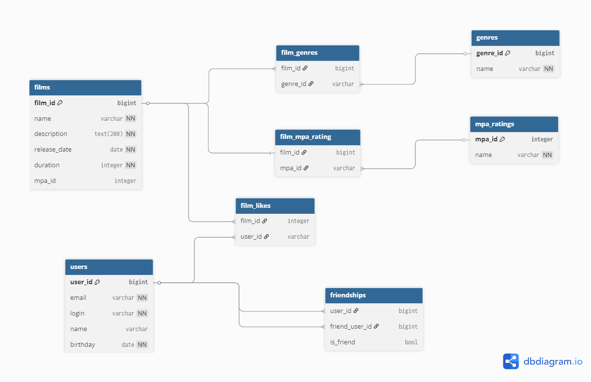

# java-filmorate
Фильмов много — и с каждым годом становится всё больше. Чем их больше, тем больше разных оценок. Чем больше оценок, тем сложнее сделать выбор. Однако не время сдаваться! Мы написали бэкенд для сервиса, который работает с фильмами и оценками пользователей, а также возвращает топ-5 фильмов, рекомендованных к просмотру.
## Схема базы данных

[Ссылка на схему базы данных](https://dbdiagram.io/d/68daa3f4d2b621e4226dcc3b)
### Описание базы данных
#### films
Содержит данные о фильмах:
* film_id - id фильма (тип bigint).
* name - название фильма (тип varchar).
* description - описание фильма (тип text с ограничением 200 символов). 
* release_date - дата выхода фильма (тип date). 
* duration - длительность фильма (тип integer). 
* rating_id - id рейтинга фильма (тип integer).
#### film_genres
Содержит id жанров для каждого фильма:
* film_id - id фильма (тип bigint).
* genre_id - id жанра (тип bigint).
#### genres
Содержит данные о жанрах:
* genre_id - id жанра (тип integer).
* name - название жанра (тип varchar).
#### film_mpa_rating
Содержит id MPA-рейтинга для каждого фильма:
* film_id - id фильма (тип bigint).
* mpa_id - id MPA-рейтинга (тип integer).
#### mpa_ratings
Содержит данные рейтингов по стандарту MPA:
* mpa_id - id MPA-рейтинга (тип integer).
* name - название MPA-рейтинга (тип varchar).
#### film_likes
Содержит id пользователей, которым понравился фильм:
* film_id - id фильма (тип bigint).
* user_id - id пользователя, которому понравился фильм (тип bigint).
#### users
Содержит данные о пользователях:
* user_id - id пользователя (тип bigint).
* email - электронная почта пользователя (тип varchar).
* login - логин пользователя (тип varchar).
* name - имя пользователя (тип varchar).
* birthday - день рождения пользователя (тип date).
#### friendships
Содержит данные о дружбе пользователей:
* user_id - id пользователя (тип bigint).
* friend_user_id - id друга (тип bigint).
* is_friend - подтверждение дружбы (тип boolean).
### Примеры запросов
* Получить данные о всех фильмах:
```
SELECT *
FROM films;
```
* Получить данные о фильме по его id:
```
SELECT * 
FROM films 
WHERE films.id = 10;
```
* Получить данные о 5 фильмах с наибольшим количеством лайков:
```
SELECT f.name,
       COUNT(fl.user_id) AS likes
FROM films AS f
LEFT JOIN film_likes AS fl ON f.film_id = fl.film_id
GROUP BY f.film_id
ORDER BY likes DESC
LIMIT 5;
```
* Добавление фильма:
```
INSERT INTO films (name, duration, description, release_date, mpa_id)
VALUES (`Название`, 10, `Описание`, `2025-05-05`, `PG`);
```
* Получить данные о пользователе по его id:
```
SELECT *
FROM users
WHERE users.user_id = 10;
```
* Получить друзей пользователя с id 1:
```
SELECT u.*
FROM users AS u
JOIN friendships f ON u.user_id = f.friend_id
WHERE f.user_id = 1 AND f.is_friend = 1;
```
* Получить общих друзей двух пользователей с id 1 и 2:
```
SELECT u.*
FROM users AS u
JOIN friendships f1 ON u.user_id = f1.friend_id AND f1.user_id = 1 AND f1.is_friend = 1
JOIN friendships f2 ON u.user_id = f2.friend_id AND f2.user_id = 2 AND f2.is_friend = 1;
```
